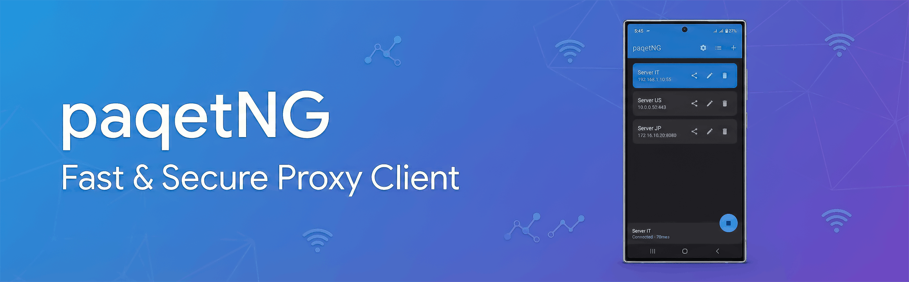

# paqetNG



[](https://github.com/AliRezaBeigy/paqetNG/actions/workflows/build-release.yml)
[](https://developer.android.com)
[](https://kotlinlang.org)


A modern Android app for [paqet](https://github.com/hanselime/paqet), the packet-level proxy that uses raw sockets and KCP. Built using [hev-socks5-tunnel](https://github.com/heiher/hev-socks5-tunnel) for native TUN/SOCKS5 tunneling.

> **Root required:** This app needs a **rooted** Android device to work. Root is required because paqet uses **pcaplib** for raw packet capture. It will not work on non-rooted devices.

## Quick Start

### Prerequisites

- **Rooted Android device** — Required to run the app; paqet uses pcaplib for raw packet capture, which needs root.
- **JDK 11+** — For building the project
- **Android SDK** — API 24–36
- **Android NDK** — Required to build the native `hev-socks5-tunnel` library. The app builds without it, but TUN routing will not work until the lib is built.
- **Git** — With submodule support for cloning hev-socks5-tunnel and paqet

### Build from Source

**Clone with submodules:**

```bash
git clone --recurse-submodules https://github.com/AliRezaBeigy/paqetNG.git
cd paqetNG
```

If the repo is already cloned:

```bash
git submodule update --init --recursive
```

This will:
1. Clone paqetNG and its submodules (hev-socks5-tunnel, paqet)
2. Initialize nested submodules so the project is ready to build

**NDK (for native lib):** Set one of `ANDROID_NDK_HOME`, `NDK_HOME`, or `ndk.dir` in `local.properties`. If the native lib is missing, the first Gradle build will run the hev-socks5-tunnel build when NDK is available.

**Assemble release:**

```bash
./gradlew assembleRelease
```

APK output: `app/build/outputs/apk/release/app-release.apk`

**Assemble debug:**

```bash
./gradlew assembleDebug
```

### Windows

On Windows, the first build may run `fixHevtunSymlinks` (PowerShell) to fix Git symlinks in the hev-socks5-tunnel submodule. Ensure PowerShell execution policy allows the script.

## Releases

Release builds and GitHub releases are produced by CI on tag push. See [`.github/workflows/build-release.yml`](.github/workflows/build-release.yml).

**To create a release:**

1. Tag and push (e.g. `v1.0.0`):

   ```bash
   git tag v1.0.0
   git push origin v1.0.0
   ```

2. The workflow builds the release APK and creates a GitHub Release with the APK attached.

## Features

- **Native TUN/SOCKS5** — System-level tunneling via hev-socks5-tunnel
- **paqet integration** — Connect to paqet servers for raw packet transport over KCP
- **Jetpack Compose UI** — Material-style, reactive Android interface
- **Release automation** — CI builds APKs and GitHub releases on tag push

## License

See the project and submodule licenses (e.g. hev-socks5-tunnel, lwip, yaml).

## Acknowledgments

- [paqet](https://github.com/hanselime/paqet) — Ferries Packets Across Forbidden Boundaries
- [v2rayNG](https://github.com/2dust/v2rayNG) — V2Ray/Xray client for Android

---

**Made with ❤️ for privacy and security**
